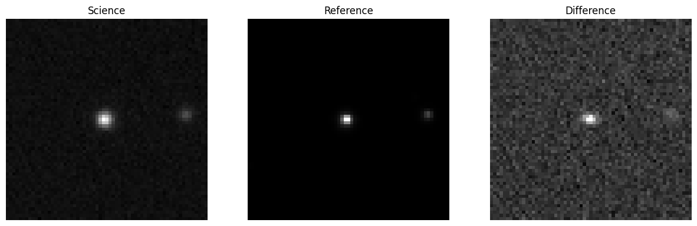
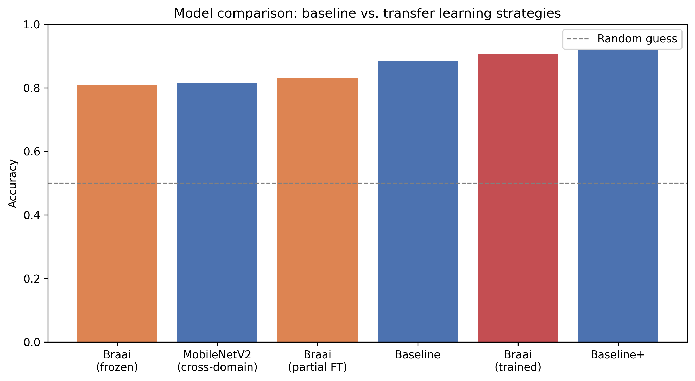

# ZTF real/bogus CNN

This project implements and evaluates computer vision models to classify astronomical events from the Zwicky Transient Facility (ZTF) survey. The main objective is to perform real-bogus classification using 63×63 pixel triplet images (science, reference, and difference) via ALeRCE broker. Additionally, it extends to multiclass classification (transient, periodic, stochastic) and includes transfer learning experiments using MobileNetV2 and Braai.

<p align="center">
  
</p>
<p align="center"><em>.fits file example which contains a triplet of images to train a CNN.</em></p>


This study surfaces a concrete domain-shift finding: a pre-trained real/bogus classifier (Braai, trained on ZTF data from a
different processing pipeline) fails completely on this dataset (44.8% accuracy), and neither frozen feature extraction
nor partial fine-tuning recovers it. Only full fine-tuning closes the gap, reaching ~92% accuracy. However, this requires further analysis, as the model available in the Braai repository may well have failed on its construction or loading in this project.


## Overview


- **Notebook I — Dataset construction**
  - Querying the ALeRCE database for confirmed real transients (SN, VS) and bogus detections,
    with class balance queries.
  - Parallelized download of FITS stamps via the ALeRCE API..
  - Cleaning (shape validation) and L2 per-channel normalization of the image triplets.

- **Notebook II — Modeling: baseline, transfer learning, and threshold selection**
  - A CNN baseline (~88% accuracy), then an improved version (Baseline+) with data
    augmentation and dropout (~92% accuracy), mitigating the overfitting seen in the baseline.
  - Transfer learning from MobileNetV2 (ImageNet, extern domain) a working but noticeably
    weaker feature extractor (~81% accuracy) for this domain.
  - Transfer learning from Braai (same domain, ZTF real/bogus) across four strategies: zero
    inference, frozen feature extraction, partial fine-tuning (single conv block), and full
    fine-tuning; used to diagnose and explain the domain-shift finding above in the first strategy.
  - Decision threshold, comparing the accuracy optimal threshold against a science threshold chosen to minimize false negatives (missed real transients).

- **Notebook III — Multiclass extension (Transient / Periodic / Stochastic)** 

  - Best CNN baseline of notebook II on multiclass evaluation... 

## Repository structure

```
.
├── notebooks/
|   ├── functions.py                      # data/model helpers functions used by both notebooks
|   ├── utils_braai.py                    # Braai model loading, error analysis plotting
│   ├── ztf_real_bogus_cnn_I.ipynb    # Data acquisition, cleaning, normalization
│   ├── ztf_real_bogus_cnn_II.ipynb   # Baseline, transfer learning, threshold selection
│   └── ztf_real_bogus_cnn_III.ipynb  # Multiclass extention (not implemented) 
├── data/
│   ├── labels/                       # oid + label CSVs generated by Notebook I
│   ├── stamps/                       # downloaded FITS triplets
│   └── processed/                    # X_data.npy / y_labels.npy to Notebook II
├── models/                           # Braai architecture, weights
├── requirements.txt
└── README.md
```


## Requirements

```bash
pip install -r requirements.txt
```

Notebook II depends on `data/processed/X_data.npy` and
`y_labels.npy`, generated at the end of Notebook I. models/ are defined in [Dmitry Duev's braai repository](https://github.com/dmitryduev/braai).


## Primary results


<p align="center">
  
</p>
<p align="center"><em>CNN strategies evaluated.</em></p>


At the accuracy optimal decision threshold (0.5), the model achieves a false negative rate of
7.7% and a false positive rate of 8.4%. Shifting to a science threshold (0.2) trades ~1.4
points of overall accuracy for a false negative rate reduction to under 4% since missing a real
transient (e.g., a supernova) is scientifically far costlier than spending time studying an extra
bogus label.


## Limitations

- The dataset is comparatively small (~5,000 balanced examples), which limits how far
  architecture complexity can be pushed before overfitting dominates.
- The Braai domain-shift result is diagnosed but not fully explained. Differences between ALeRCE's and Braai's original ZTF pipeline are
  inferred, not directly verified against Braai's original training data.


## References

- Duev, D. A., Mahabal, A., Masci, F. J., Graham, M. J., Rusholme, B., Walters, R., Karmarkar,
  I., Frederick, S., Kasliwal, M. M., & Rebbapragada, U. (2019). Real-bogus classification for the
  Zwicky Transient Facility using deep learning (braai). *Monthly Notices of the Royal
  Astronomical Society*, 489(3), 3582–3590. https://doi.org/10.1093/mnras/stz2357
- Sánchez-Sáez, P., et al. (2021). The Automatic Learning for the Rapid Classification of Events
  (ALeRCE) Alert Broker. *The Astronomical Journal*, 161(5), 242.
  https://doi.org/10.3847/1538-3881/abe9bc
- Bellm, E. C., et al. (2019). The Zwicky Transient Facility: System overview, performance, and
  first results. *Publications of the Astronomical Society of the Pacific*, 131(995), 018002.
  https://doi.org/10.1088/1538-3873/aaecbe
- Masci, F. J., et al. (2019). The Zwicky Transient Facility: Data Processing, Products, and
  Archive. *Publications of the Astronomical Society of the Pacific*, 131(995), 018003.
  https://doi.org/10.1088/1538-3873/aae8ac
- Sandler, M., Howard, A., Zhu, M., Zhmoginov, A., & Chen, L.-C. (2018). MobileNetV2: Inverted
  Residuals and Linear Bottlenecks. *Proceedings of the IEEE/CVF Conference on Computer Vision and
  Pattern Recognition (CVPR)*, 4510–4520. https://doi.org/10.1109/CVPR.2018.00474


